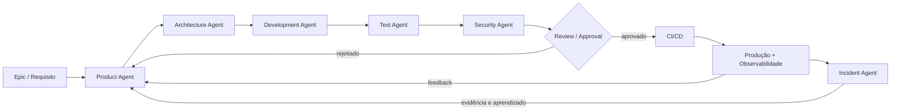
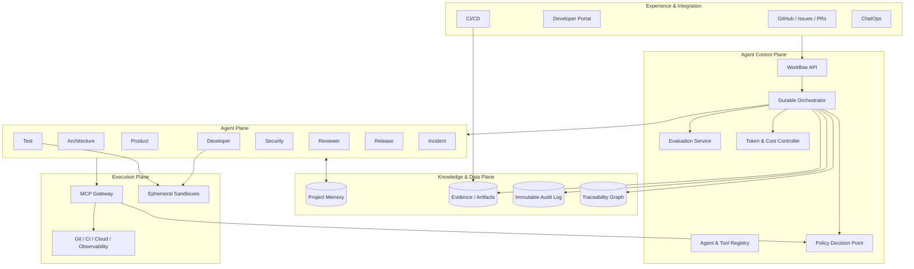

# Agentic SDLC Reference Architecture

Arquitetura de referência para uma plataforma de engenharia de software orientada por agentes, cobrindo o fluxo completo entre demanda e produção. O objetivo não é criar “um agente que escreve código”, mas um **sistema sociotécnico governado**, no qual agentes especializados trabalham com contexto, ferramentas e permissões mínimas, enquanto decisões de risco permanecem sob aprovação humana.

> Esta proposta deriva os princípios de plataforma, governança, segurança, observabilidade e FinOps da [Enterprise AI Platform Reference Architecture](https://github.com/leandrosflora/enterprise-ai-platform-reference-architecture), adotada como fonte conceitual da verdade, e os aplica ao domínio de SDLC.

## Objetivos

- Orquestrar agentes especializados do requisito ao feedback de produção.
- Preservar segregação de funções: quem implementa não aprova nem publica.
- Manter rastreabilidade verificável entre requisito, decisão, código, teste, evidência, aprovação, artefato e deploy.
- Aplicar segurança por padrão com identidade de workload, isolamento, permissões por agente e policy-as-code.
- Medir qualidade, velocidade, autonomia, confiabilidade e custo por mudança.
- Permitir intervenção humana, cancelamento, rollback e limitação de blast radius em todas as fases críticas.

## Fluxo principal



Cada transição produz um **evidence bundle** assinado; o orquestrador somente avança quando contratos, políticas e gates da etapa forem satisfeitos.

## Agentes e segregação de funções

| Agente | Responsabilidade | Pode escrever em | Não pode |
|---|---|---|---|
| Product | Refinar requisitos e critérios de aceite | backlog e `requirements/` | alterar código ou aprovar release |
| Architecture | Produzir C4, ADRs, contratos e análise de blast radius | `architecture/` e `contracts/` | publicar artefatos |
| Developer | Implementar mudanças dentro do escopo aprovado | branch/ambiente efêmero | aprovar o próprio PR ou acessar produção |
| Test | Criar e executar testes; avaliar cobertura e mutações | testes e evidências | reduzir gates ou publicar |
| Security | SAST, SCA, secrets e threat modeling | achados e evidências | editar a implementação silenciosamente |
| Reviewer | Verificar qualidade, escopo, arquitetura e evidências | parecer de revisão | implementar ou fazer deploy |
| Release | Preparar versão, rollout e rollback | manifesto de release | ignorar aprovação humana/política |
| Incident | Correlacionar logs, traces, deploys e mudanças | timeline e proposta de remediação | executar ação destrutiva sem aprovação |

A matriz detalhada de permissões e gates está em [`docs/governance.md`](docs/governance.md).

## Modelo operacional

A plataforma adota **núcleo agnóstico com adaptadores específicos por ferramenta**. Os agentes executam como workers efêmeros em um runtime compartilhado; GitHub, Jira, Azure DevOps, IDEs e ChatOps funcionam como canais, sistemas de registro ou executores. O estado canônico permanece no orquestrador durável.

- [ADR do núcleo agnóstico e adaptadores](docs/adr/0001-agnostic-core-and-sdlc-adapters.md)
- [Topologia de deployment](docs/deployment.md)
- [Modelo de runtime dos agentes](docs/agent-runtime.md)
- [Matriz agente × ferramenta × operação](docs/tool-integration-matrix.md)
- [Jornada completa de uma mudança](docs/change-journey.md)

## Artefatos implementáveis

O P1 adiciona contratos e um golden path executável, sem dependências externas:

- [Manifesto de onboarding](contracts/project-manifest.schema.json) e [exemplo](examples/project-manifest.instance.json)
- [Contrato canônico de integração](contracts/canonical-integration.schema.json) e [exemplo](examples/canonical-integration.instance.json)
- [Modelo de contexto](docs/context-model.md)
- [Change Set multi-repositório](docs/multi-repository-change-set.md), [schema](contracts/change-set.schema.json) e [exemplo](examples/change-set.instance.json)
- [Golden path executável](scripts/run_golden_path.py)

Execute:

~~~bash
python3 scripts/run_golden_path.py
python3 scripts/validate.py
~~~

O golden path carrega o projeto, recebe um evento canônico, valida dependências de três repositórios, percorre agentes e gates, vincula aprovação ao conjunto e produz um evidence bundle determinístico.

## Experiência e consumo

A arquitetura possui uma camada consumível e publicável:

- **MkDocs Material:** documentação navegável e publicação automática no GitHub Pages;
- **Portal mínimo:** dashboard em [docs/portal/](docs/portal/index.html), desacoplado de framework e pronto para evoluir para plugin Backstage;
- **GitHub Check:** o job Workflow, cost and evidence valida o golden path em cada PR;
- **Comentário no PR:** resumo idempotente com mudança, risco, progresso, custo e evidências;
- **Dashboard:** workflow por agente, Change Set, custo por etapa e evidence bundle.

Após o merge, a documentação será publicada em:

https://leandrosflora.github.io/agentic-sdlc-reference-architecture/

Para visualizar localmente:

~~~bash
pip install -r requirements-docs.txt
mkdocs serve
~~~

## Runtime funcional compartilhado

O runtime está implementado em [agentic-sdlc-runtime](https://github.com/leandrosflora/agentic-sdlc-runtime). Ele executa as definições declarativas dos oito agentes e fornece:

- Context Builder com proveniência, classificação e minimização;
- Model Gateway fake e OpenAI-compatible;
- MCP fake para testes com grants por papel;
- eventos compatíveis com agent-event.schema.json;
- evidence bundles persistidos por hash;
- checkpoints atômicos e retomada sem repetir model call;
- CLI, demo, testes e CI em Python 3.11/3.12.

As definições canônicas estão em [agents/](https://github.com/leandrosflora/agentic-sdlc-runtime/tree/master/agents). Os repositórios sdlc-role-agent continuam como adapters/scaffolds específicos de papel; não são serviços persistentes nem a fonte canônica do ciclo de execução.

## Implementações operacionais

Este repositório mantém arquitetura, contratos, policies e golden paths. O código do runtime compartilhado fica no [agentic-sdlc-runtime](https://github.com/leandrosflora/agentic-sdlc-runtime). Os 8 papéis acima possuem definições e skeletons em repositórios próprios. Eles não precisam ser oito serviços persistentes: são executados pelo runtime compartilhado. Os repositórios são nomeados `sdlc-<role>-agent` onde `<role>` é o valor de `agent_role` usado em [`policies/agent_authorization.rego`](policies/agent_authorization.rego):

| Agente | Repositório | Estado |
|---|---|---|
| Product | [sdlc-product-agent](https://github.com/leandrosflora/sdlc-product-agent) | adapter/scaffold; definição canônica no runtime |
| Architecture | [sdlc-architecture-agent](https://github.com/leandrosflora/sdlc-architecture-agent) | adapter/scaffold; definição canônica no runtime |
| Developer | [sdlc-developer-agent](https://github.com/leandrosflora/sdlc-developer-agent) | adapter/scaffold; definição canônica no runtime |
| Test | [sdlc-test-agent](https://github.com/leandrosflora/sdlc-test-agent) | adapter/scaffold; definição canônica no runtime |
| Security | [sdlc-security-agent](https://github.com/leandrosflora/sdlc-security-agent) | adapter/scaffold; definição canônica no runtime |
| Reviewer | [sdlc-reviewer-agent](https://github.com/leandrosflora/sdlc-reviewer-agent) | adapter/scaffold; definição canônica no runtime |
| Release | [sdlc-release-agent](https://github.com/leandrosflora/sdlc-release-agent) | adapter/scaffold; definição canônica no runtime |
| Incident | [sdlc-incident-agent](https://github.com/leandrosflora/sdlc-incident-agent) | adapter/scaffold; definição canônica no runtime |

Cada repo chama `opa eval` diretamente contra o rego deste repositório (por padrão, checkout irmão no mesmo diretório pai) — a política de autorização não é duplicada nos agentes. As ações do papel (ex.: `repository.write` do developer, `production.deploy` do release) ainda são handlers stub: autorizadas ou negadas de acordo com a política real, mas sem efeito nem chamada a LLM implementados.

## Arquitetura



### Planos da plataforma

1. **Experience & Integration:** GitHub, portal, ChatOps e pipelines são os pontos de entrada, nunca credenciais diretas para modelos ou ferramentas.
2. **Agent Control Plane:** mantém workflows duráveis, catálogo versionado, políticas, avaliações, budgets e aprovações.
3. **Agent Plane:** cada agente possui identidade, prompt, modelo, ferramentas, budget e escopo próprios.
4. **Knowledge & Data Plane:** memória segregada por projeto, evidências imutáveis, auditoria e grafo de rastreabilidade.
5. **Execution Plane:** todo efeito colateral passa pelo MCP Gateway; execução de código ocorre em sandbox efêmero, sem segredo persistente.

Veja a descrição completa em [`docs/architecture.md`](docs/architecture.md) e as decisões em [`docs/adr/`](docs/adr/).

## Controles essenciais

- **Human-in-the-loop:** aprovação obrigatória para mudança de alto risco, produção, exceção de política e ação destrutiva.
- **Least privilege:** tokens de curta duração vinculados à identidade do agente, projeto, tarefa e ferramenta.
- **Policy-as-code:** decisão central antes de tool calls e novamente nos gates de pipeline; exemplo em [`policies/agent_authorization.rego`](policies/agent_authorization.rego).
- **Isolamento:** worktree/container efêmero, rede deny-by-default, filesystem restrito, limites de CPU/memória/tempo e egress allowlist.
- **Supply chain:** commits e artefatos assinados, SBOM, proveniência e promoção do mesmo digest entre ambientes.
- **Memória segura:** namespaces por tenant/projeto, classificação de dados, retenção, fontes citadas e proteção contra prompt injection.
- **Mudança segura:** canary/progressive delivery, error budget, kill switch, rollback testado e blast radius explícito.
- **FinOps:** limite por execução/projeto e atribuição de custo e tokens ao `change_id`. Roteamento de modelo por risco/qualidade e política de FinOps corporativa seguem o [FinOps Platform](https://github.com/leandrosflora/enterprise-ai-platform-reference-architecture/blob/main/docs/domains/finops-platform.md) e o [Model Selection Framework](https://github.com/leandrosflora/enterprise-ai-platform-reference-architecture/blob/main/docs/architecture/model-selection-framework.md) do repositório de plataforma.

## Contratos e rastreabilidade

O contrato mínimo de uma mudança está em [`contracts/change-envelope.schema.json`](contracts/change-envelope.schema.json). Um `change_id` acompanha todos os eventos e relaciona:

```text
requirement → acceptance criteria → ADR/contract → commit/PR → test/security evidence
            → human approval → artifact digest → deployment → telemetry/incident
```

Eventos usam o envelope em [`contracts/agent-event.schema.json`](contracts/agent-event.schema.json), incluindo identidade, correlação, custo, tokens, decisão de política e referências de evidência.

Versionamento e compatibilidade de contrato (SemVer, major imutável, sem remoção de campo dentro do mesmo major) seguem a convenção de [Contratos de Eventos](https://github.com/leandrosflora/enterprise-ai-platform-reference-architecture/blob/main/docs/contracts/events.md) do repositório de plataforma; este repositório não redefine a política, apenas a aplica aos schemas de `contracts/`.

## Métricas

| Dimensão | Métricas principais |
|---|---|
| Flow | lead time, cycle time, tempo por gate, WIP |
| Qualidade | retrabalho, defeitos escapados, precisão dos testes gerados, mutation score |
| Governança | taxa de aprovação humana, alterações rejeitadas, violações e exceções de política |
| Confiabilidade | change failure rate, MTTR, rollback rate, blast radius |
| Agentes | task success, groundedness, tool-call success, percentual da entrega executado por agentes |
| FinOps | custo e tokens por mudança/agente/etapa, budget excedido, cache hit rate |

As fórmulas e dimensões obrigatórias estão em [`docs/metrics.md`](docs/metrics.md).

## Estrutura do repositório

```text
.
├── contracts/                 # schemas de eventos, onboarding, integração e Change Set
├── docs/
│   ├── adr/                   # decisões arquiteturais
│   ├── architecture.md        # componentes e fluxos
│   ├── deployment.md          # topologia e trust zones
│   ├── agent-runtime.md       # execução, estado e composição
│   ├── tool-integration-matrix.md # agentes e ferramentas
│   ├── change-journey.md      # fluxo ponta a ponta
│   ├── context-model.md       # montagem e proteção de contexto
│   ├── multi-repository-change-set.md # coordenação multi-repo
│   ├── portal/                # dashboard operacional estático
│   ├── governance.md          # papéis, gates e autorização
│   ├── metrics.md             # SLOs e métricas
│   └── threat-model.md        # ameaças e controles
├── examples/                  # workflow, change envelope e trilhas de eventos (aprovado, rejeitado, rollback), validáveis contra os schemas
├── policies/                  # policy-as-code (OPA/Rego)
├── scripts/                   # validação, golden path e renderização
├── mkdocs.yml                 # navegação e tema da documentação
└── requirements-docs.txt      # dependências fixadas do MkDocs
```

## Validação local

```bash
python3 scripts/validate.py
```

O validador verifica JSON Schemas, exemplos, referências de agentes e invariantes de segregação de funções sem depender de pacotes externos.

## Roadmap de adoção

1. **Assistido:** Product, Architecture e Developer geram propostas; humanos executam e aprovam.
2. **Governado:** MCP Gateway, identidades, evidence bundles, policies e avaliações bloqueantes.
3. **Automatizado:** agentes executam mudanças de baixo risco em sandboxes e abrem PRs.
4. **Progressivo:** Release Agent promove automaticamente canários dentro de budgets e SLOs.
5. **Adaptativo:** feedback de produção melhora avaliações e memória, sem autoalterar políticas ou prompts promovidos.

Autonomia é concedida por **classe de risco e evidência observada**, nunca apenas por capacidade do modelo.
