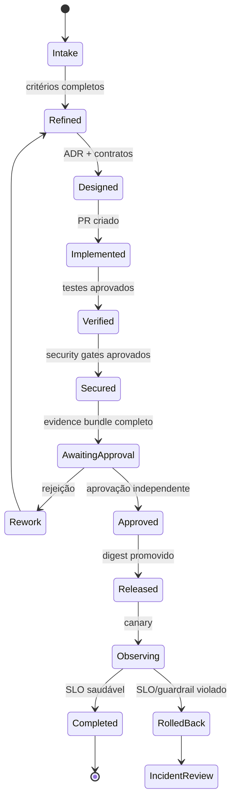
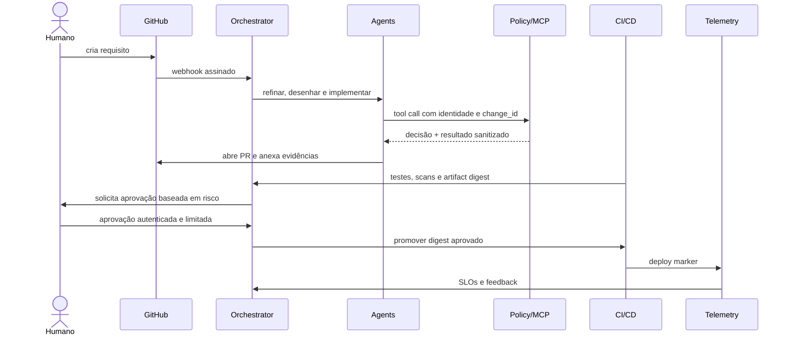

# Arquitetura da plataforma

## Princípios

1. **Workflow antes de autonomia:** estados, retries, timeout, compensações e aprovações são explícitos e persistidos.
2. **Agentes sem autoridade implícita:** uma resposta do modelo é uma proposta; somente ferramentas autorizadas causam efeitos.
3. **Contexto com proveniência:** toda memória recuperada informa fonte, versão, classificação e validade.
4. **Evidência antes de promoção:** nenhuma etapa é concluída somente por autodeclaração do agente.
5. **Identidade fim a fim:** pessoa, agente, modelo, workflow e workload aparecem no audit log.
6. **Observabilidade por desenho:** cada execução propaga `trace_id`, `change_id`, `project_id` e `agent_run_id`.

## Componentes

### Workflow API e orquestrador durável

Recebem webhooks autenticados, materializam uma máquina de estados e garantem idempotência. O estado canônico contém versão do workflow, risco, budgets, responsáveis, evidências e aprovações. Reexecuções usam chaves idempotentes e não repetem side effects.

### Agent Registry

Catálogo versionado de agentes. Cada versão declara finalidade, proprietário, modelo permitido, prompt digest, ferramentas, schemas de entrada/saída, limites, avaliações mínimas e identidade de workload. Promoção exige avaliação offline, red team e aprovação independente.

### MCP Gateway

Única saída para ferramentas corporativas. Valida schema, identidade, escopo, política e consentimento; remove segredos da resposta; aplica rate limit; registra request/response sanitizados. Servidores MCP são classificados como read-only, write-nonprod, write-prod ou privileged.

### Policy Decision Point

Decide `allow`, `deny` ou `require_approval` usando identidade, ação, recurso, ambiente, risco, evidências e janela de mudança. A decisão e o bundle de política ficam anexados ao evento auditável.

### Project Memory

Combina documentos versionados, catálogo, ADRs, contratos e histórico aprovado. Namespaces e chaves são segregados por tenant/projeto; RBAC/ABAC é aplicado antes da recuperação. Conteúdo recuperado é dado não confiável, delimitado do prompt de sistema e filtrado contra exfiltração.

### Evaluation Service

Executa avaliações determinísticas e baseadas em modelo: schema, testes, segurança, groundedness, aderência ao requisito, tool selection e regressão. Juízes baseados em LLM nunca são o único gate para produção.

### Cost Controller

Reserva budget antes da execução, contabiliza input/output/cache/tool cost e interrompe com checkpoint ao atingir limites, atribuindo tudo ao `change_id`. Seleção e roteamento de modelo por risco/qualidade seguem o [Model Selection Framework](https://github.com/leandrosflora/enterprise-ai-platform-reference-architecture/blob/main/docs/architecture/model-selection-framework.md) do repositório de plataforma; nenhuma redução de modelo contorna os gates deste repositório.

### Evidence Store, Audit Log e Traceability Graph

Evidências grandes ficam em object storage WORM com hash; o audit log append-only registra metadados e referências; o grafo permite impacto e auditoria do requisito ao deploy. Dados sensíveis são redigidos antes da persistência.

## Máquina de estados

Estados terminais e side effects são idempotentes. `cancelled`, `timed_out` e `policy_denied` podem ser alcançados de qualquer etapa, preservando as evidências já produzidas.

## Sequência de uma mudança

## Topologia de deployment

- Control plane em cluster dedicado, multi-AZ, sem executar código gerado.
- Runners efêmeros em contas/projetos separados por trust zone; produção não compartilha runner com desenvolvimento.
- Egress somente via proxies e MCP Gateway; endpoints de metadados de nuvem bloqueados.
- Segredos obtidos just-in-time por workload identity, com TTL inferior à tarefa e nunca inseridos no contexto do modelo.
- Bancos com criptografia, backup, PITR e chaves separadas por ambiente; audit log em domínio administrativo distinto.
- Kill switches por agente, ferramenta, projeto e plataforma.

## Disponibilidade e falhas

O orquestrador faz checkpoint entre etapas. Chamadas a modelo e ferramenta usam timeout, retry com backoff apenas para erros transitórios, circuit breaker e idempotency key. Se policy, identidade ou auditoria estiverem indisponíveis, chamadas de escrita falham fechadas. Falhas de telemetria impedem promoção, mas não impedem rollback manual.

## Feedback sem autoenvenenamento

Telemetria e incidentes alimentam um staging de conhecimento. Conteúdo só entra na memória promovida após sanitização, deduplicação, verificação de origem e aprovação do owner. Prompts, políticas e conjuntos de avaliação são versionados e promovidos por pipeline separado; nenhum agente altera seus próprios controles.

## Decisões operacionais relacionadas

- [ADR 0001 — núcleo agnóstico com adaptadores](adr/0001-agnostic-core-and-sdlc-adapters.md)
- [Topologia de deployment](deployment.md)
- [Modelo de runtime dos agentes](agent-runtime.md)
- [Matriz agente × ferramenta × operação](tool-integration-matrix.md)
- [Jornada completa de uma mudança](change-journey.md)

O núcleo da plataforma é independente de fornecedor. GitHub, Jira, Azure DevOps, IDEs e ChatOps são canais ou sistemas de registro integrados por adaptadores. Os papéis de agente são definições lógicas executadas como workers efêmeros por um runtime compartilhado; o orquestrador, e não os agentes ou ferramentas externas, mantém o estado canônico.
