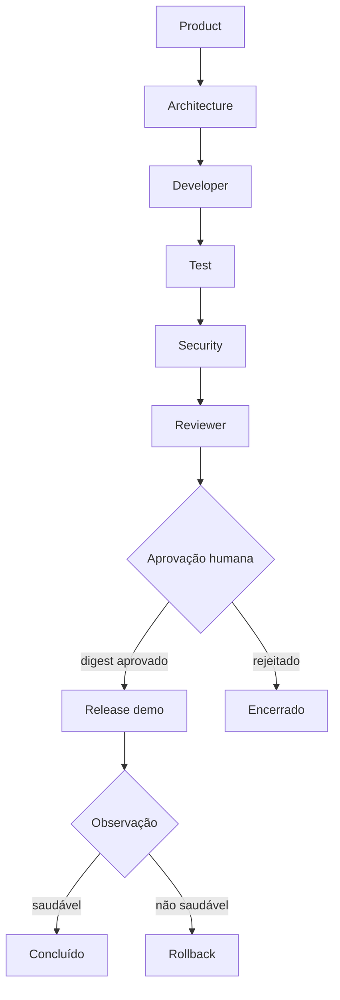
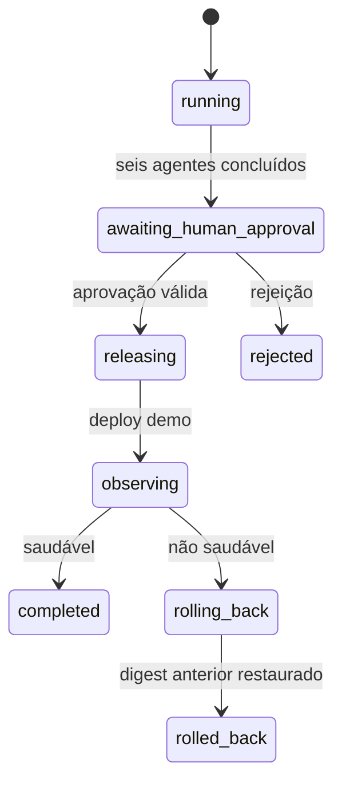

# Integração ponta a ponta (P5)

O P5 conecta os agentes declarativos em um workflow durável que parte da demanda, exige aprovação humana vinculada ao artefato e termina em uma liberação observada no ambiente demo — com rollback automático quando a observação falha.

A implementação executável está no [agentic-sdlc-runtime](https://github.com/leandrosflora/agentic-sdlc-runtime).

## Fluxo



## Responsabilidade e saída de cada etapa

| Etapa | Responsabilidade | Saída persistida |
|---|---|---|
| Product | estruturar objetivo e critérios de aceite | resultado, eventos e evidence bundle |
| Architecture | definir abordagem, restrições e impacto | resultado, eventos e evidence bundle |
| Developer | produzir a implementação proposta | resultado, eventos e evidence bundle |
| Test | avaliar critérios e comportamento | resultado, eventos e evidence bundle |
| Security | avaliar riscos e controles | resultado, eventos e evidence bundle |
| Reviewer | consolidar a revisão independente | resultado, eventos e evidence bundle |
| Aprovação humana | autorizar exatamente o digest revisado | identidade, decisão, data e digest |
| Release | promover o digest imutável no ambiente demo | registro de deployment e evidências |
| Observação | avaliar a saúde após a liberação | sinal saudável/não saudável |
| Rollback | restaurar o digest anterior | histórico e estado restaurado |

## Máquina de estados



O checkpoint é atualizado depois de cada agente e de cada transição operacional. Uma retomada lê o checkpoint e não repete chamadas de modelo já concluídas.

## Gate humano

A aprovação é uma decisão de segurança, não um simples botão:

- o aprovador deve ser identificado;
- o autor da mudança não pode aprovar a própria entrega;
- a decisão deve referenciar o digest exato calculado após a revisão;
- qualquer digest diferente bloqueia o release;
- rejeição encerra a progressão sem deployment.

Assim, uma alteração posterior à aprovação produz outro digest e exige nova aprovação.

## Release, observação e rollback

O ambiente demo é um adapter local durável, persistido em JSON. Ele mantém o digest atual, o anterior e o histórico de operações. No caminho saudável, o Release Agent promove o mesmo digest aprovado e o workflow termina como `completed`.

Se o sinal de observação for negativo, o runtime executa rollback e restaura o digest anterior. O workflow termina como `rolled_back`; a falha não é mascarada como sucesso.

Este adapter demonstra as semânticas de promoção e recuperação sem credenciais de nuvem. Um adapter real deve preservar o mesmo contrato e substituir apenas as operações de deployment e telemetria.

## Executar

No repositório do runtime:

```bash
python examples/end_to_end_demo.py
python examples/end_to_end_demo.py --unhealthy
pytest
```

O primeiro comando percorre o caminho saudável. O segundo força a observação negativa e verifica o rollback para o digest estável anterior.

## Garantias atuais

- ordem determinística dos seis agentes;
- resultados e evidências persistidos pelo runtime;
- checkpoint após cada etapa;
- aprovação humana segregada e vinculada ao digest;
- release somente depois do gate;
- observação explícita;
- rollback automático e auditável;
- testes cobrindo sucesso, rollback, autoaprovação e digest inválido.

## Limites do ambiente demo

A integração é funcional, mas deliberadamente local: o Model Gateway fake produz respostas determinísticas e o ambiente demo persiste estado em arquivo. A próxima evolução troca adapters por provedores reais de modelo, CI/CD e observabilidade, mantendo o workflow, os contratos e as garantias de governança.
