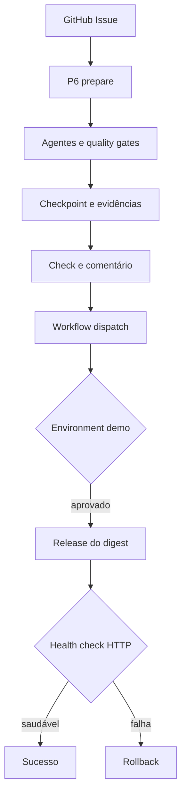

# P6 — Integração real controlada

O P6 transforma o workflow durável em uma vertical acionável pelo GitHub, mantendo adapters e contratos independentes do fornecedor.



## Dois workflows, uma mudança

| Workflow | Disparo | Responsabilidade |
|---|---|---|
| P6 prepare | Issue aberta ou label `agentic-sdlc` | Executar agentes, testes e security scan; calcular digest; publicar Check/comentário; armazenar estado |
| P6 release demo | `workflow_dispatch` | Restaurar o estado, exigir aprovação do Environment, promover o digest, observar e reverter se necessário |

A separação permite que a preparação seja automatizada e que a promoção continue sendo uma decisão humana explícita.

## Integrações reais

- **GitHub REST:** leitura da Issue, comentários e Checks.
- **Model Gateway:** endpoint OpenAI-compatible quando configurado; fake determinístico em testes.
- **Execução:** comandos como arrays de argumentos, sem shell, executável allowlisted, timeout e saída limitada.
- **Qualidade:** pytest e scanner de secrets geram evidência associada ao digest.
- **Release:** comandos de deploy e rollback recebem somente `ARTIFACT_DIGEST`.
- **Observação:** health check HTTP/HTTPS com tentativas e timeout.
- **Persistência:** checkpoints e evidence bundles trafegam como artifacts entre os workflows.

## Configurar

No repositório que executará o runtime:

1. Crie o GitHub Environment `demo`.
2. Adicione reviewers obrigatórios e impeça autoaprovação.
3. Configure `MODEL_BASE_URL`, `MODEL_NAME`, `P6_DEPLOY_COMMAND`, `P6_ROLLBACK_COMMAND` e `P6_HEALTH_URL` como variables.
4. Configure `MODEL_API_KEY` como secret.
5. Crie o label `agentic-sdlc`.
6. Proteja a branch principal e torne os Checks do P6 obrigatórios para o repositório demo.

Exemplos de comandos, sempre em JSON:

```json
["python", "ops/deploy.py"]
```

```json
["python", "ops/rollback.py"]
```

## Operar

1. Abra uma Issue descrevendo objetivo e critérios de aceite.
2. Aguarde o comentário com o `change_id`, o digest e as evidências.
3. Abra **Actions → P6 release demo → Run workflow**.
4. Informe Issue, run ID da preparação e digest exato.
5. Um reviewer autorizado aprova o Environment `demo`.
6. O workflow publica o resultado final na Issue.

Se o health check não ficar saudável, o adapter executa rollback e marca o release como falho. O artifact final preserva evidências por 90 dias.

## Controles

- token GitHub com permissões mínimas declaradas por workflow;
- secrets fora de prompts, checkpoints e evidências;
- segregação entre autor e aprovador;
- aprovação vinculada ao digest;
- nenhum comando interpretado por shell;
- rollback executado com o digest anterior;
- Check e comentário final para rastreabilidade.

## Limites deliberados

O runtime fornece adapters, workflow e gates reais, mas não escolhe a plataforma de deployment. Docker, Kubernetes ou uma PaaS entram pelos comandos governados. Para produção, substitua artifacts temporários por storage durável/WORM e acrescente assinatura de artefato, SBOM e verificação de proveniência.
