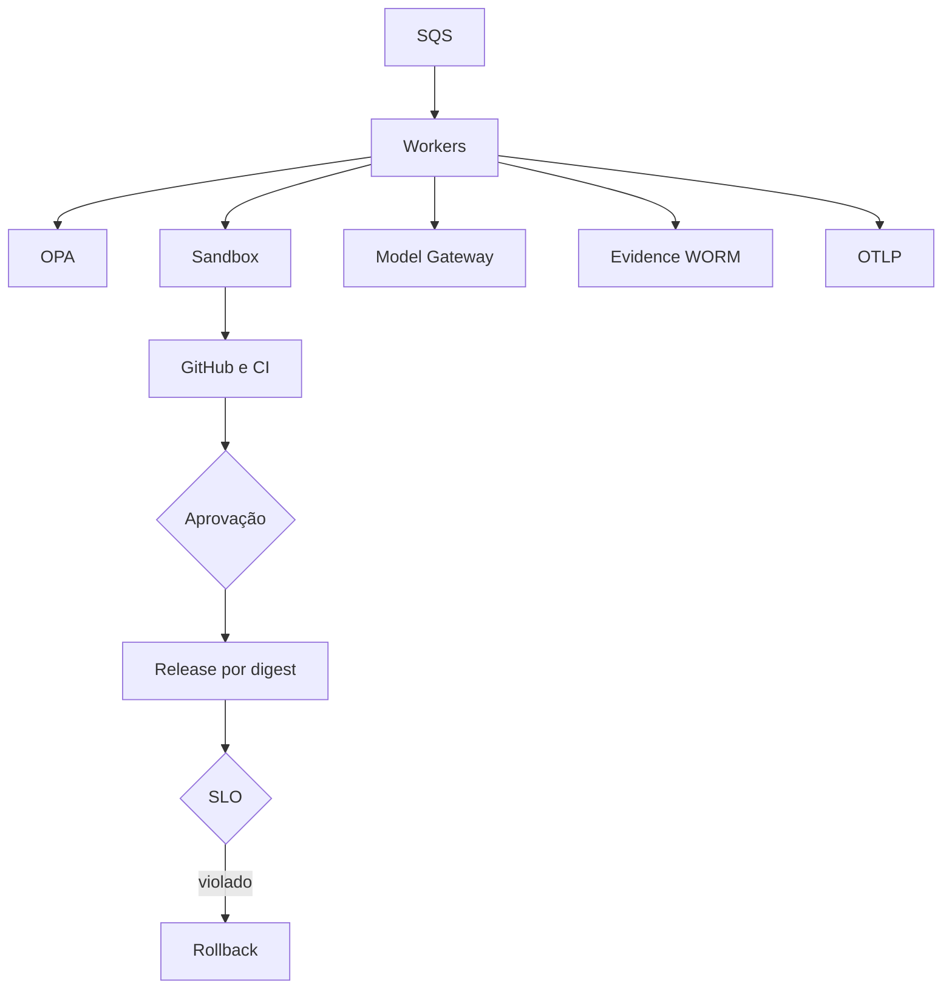

# P7 — Produção e governança

O P7 converte o runtime demonstrativo em um núcleo implantável com controles externos e fail-closed.

| Capacidade | Adapter do runtime | Pré-requisito operacional |
|---|---|---|
| OPA/PDP | decisão HTTP bloqueante | OPA HA e bundles assinados |
| Identidade | GitHub OIDC | trust policy por repo/environment |
| Evidências | objetos S3 por SHA-256 | versionamento, Object Lock e KMS |
| Supply chain | Syft + Cosign | registry por digest e política de verificação |
| Telemetria | OTLP HTTP | Collector e backend de métricas/traces |
| Budgets | ledger transacional | backend compartilhado e limites por projeto |
| Workers | fila local + SQS | DLQ, autoscaling e idempotência |
| Sandbox | Docker restrito | nodes isolados e egress allowlist |
| Change Set | ordenação topológica | aprovações ligadas ao conjunto |
| SLO | decisão rollback/continue | métricas confiáveis e runbooks |

## Developer Agent

A Issue é enviada ao Model Gateway, mas a resposta não possui autoridade direta. O runtime exige JSON estruturado, limita paths a `src/`, `tests/` e `docs/`, bloqueia workflows e arquivos sensíveis, limita tamanho e quantidade, cria branch e abre apenas draft PR. Merge permanece humano.

## Recuperação

Jobs usam lease, retry e DLQ no provider. Checkpoints tornam a execução retomável. Violação de error rate ou latência resulta em rollback. Indisponibilidade do PDP resulta em negação, não bypass.

## Critérios para produção

- OPA em alta disponibilidade e policy tests;
- OIDC sem chaves estáticas;
- evidência WORM com retenção;
- imagens por digest, SBOM e assinatura verificada;
- collectors OTLP redundantes;
- budget compartilhado e consistente;
- fila com DLQ e autoscaling;
- sandbox isolado por workload;
- testes de Change Set e rollback;
- SLOs, alertas e game days.

A implementação dos adapters está no [agentic-sdlc-runtime](https://github.com/leandrosflora/agentic-sdlc-runtime). O manifesto Kubernetes é um ponto de partida e contém placeholders que devem ser substituídos antes de qualquer deployment.
