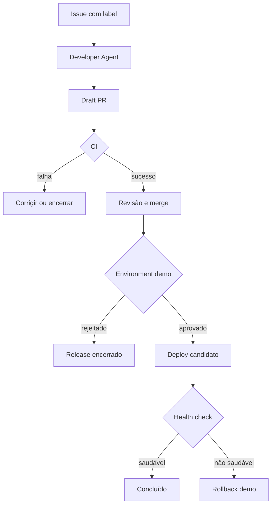

# Runbook operacional

Este runbook orienta a preparação, execução, diagnóstico e recuperação da vertical executável da Agentic SDLC Reference Architecture.

> **Escopo atual:** GitHub Issue → Developer Agent → draft PR → CI → revisão/merge humano → Environment `demo` → deploy local no runner → health check → sucesso ou rollback. O ambiente demo não equivale a produção.

## 1. Componentes

| Componente | Repositório | Função |
|---|---|---|
| Arquitetura | [agentic-sdlc-reference-architecture](https://github.com/leandrosflora/agentic-sdlc-reference-architecture) | documentação, contratos e policies |
| Runtime | [agentic-sdlc-runtime](https://github.com/leandrosflora/agentic-sdlc-runtime) | agentes, integrações, checkpoints e evidências |
| Aplicação demo | [agentic-sdlc-demo-app](https://github.com/leandrosflora/agentic-sdlc-demo-app) | alvo seguro da mudança e do release |
| Product Agent | [sdlc-product-agent](https://github.com/leandrosflora/sdlc-product-agent) | vertical independente de refinamento |

## 2. Fluxo



## 3. Responsabilidades

| Papel | Responsabilidade |
|---|---|
| Solicitante | descrever objetivo e critérios de aceite |
| Operador | configurar Actions, secrets, variables e Environment |
| Developer Agent | propor mudança, criar branch e abrir draft PR |
| Revisor | revisar código e fazer merge |
| Aprovador | autorizar ou rejeitar o Environment `demo` |
| Operador de incidente | preservar evidências e coordenar recuperação |

O autor da Issue não deve fazer o merge usado como autorização operacional. O workflow registra `github.actor`, que representa o ator do evento, e não necessariamente o reviewer do Environment.

## 4. Preparação

### GitHub Actions

No `agentic-sdlc-demo-app`:

1. Acesse **Settings → Actions → General**.
2. Selecione **Read and write permissions**.
3. Habilite **Allow GitHub Actions to create and approve pull requests**.
4. Proteja a branch `master` e exija CI verde.

### Model Gateway

Em **Settings → Secrets and variables → Actions**, configure:

| Tipo | Nome | Observação |
|---|---|---|
| Secret | `MODEL_API_KEY` | nunca registrar em Issue ou log |
| Variable | `MODEL_BASE_URL` | endpoint OpenAI-compatible |
| Variable | `MODEL_NAME` | modelo autorizado |

### Label e Environment

1. Crie o label `agentic-sdlc`.
2. Crie o Environment `demo`.
3. Configure required reviewers.
4. Use `P6_DEMO_FORCE_UNHEALTHY=true` somente em teste controlado.
5. Remova a variável após o experimento.

### Checklist de prontidão

- [ ] Runtime e demo app estão atualizados.
- [ ] CI das branches principais está verde.
- [ ] Model Gateway está configurado.
- [ ] Actions pode criar Pull Requests.
- [ ] Label `agentic-sdlc` existe.
- [ ] Environment `demo` possui reviewer.
- [ ] Solicitante, revisor e operador foram definidos.

## 5. Executar uma mudança

### Criar a Issue

Use o template **Agentic change** e comece com uma mudança pequena:

```text
Objetivo:
Adicionar o campo environment ao endpoint /version.

Critérios de aceite:
- /version retorna environment
- o valor padrão é demo
- os testes continuam passando
- existe teste para o novo campo
```

### Disparar o Developer Agent

Aplique o label `agentic-sdlc` e acompanhe:

```text
Actions → Developer Agent
```

Resultado esperado:

- branch `agent/issue-<número>-<resumo>`;
- mudanças somente em `src/`, `tests/` ou `docs/`;
- draft PR referenciando a Issue;
- comentário na Issue.

### Revisar o PR

- [ ] Diff atende aos critérios.
- [ ] Nenhum arquivo foi reescrito sem necessidade.
- [ ] Testes cobrem a mudança.
- [ ] CI está verde.
- [ ] Workflows, policies e secrets não foram alterados.
- [ ] O revisor não é o autor da Issue.

### Aprovar o release

Após o merge de uma branch `agent/issue-*`, acompanhe:

```text
Actions → Unified Agentic SDLC release
```

O job pausa no Environment `demo`. Após aprovação, resolve a Issue, implanta o candidato, consulta `/health`, publica evidências e conclui ou executa rollback.

## 6. Resultados

### Caminho saudável

- workflow `success`;
- comentário com `completed`;
- GitHub Check verde;
- artifact `agentic-release-evidence-*`;
- health check saudável.

### Rollback

- candidato não saudável;
- rollback demo executado;
- comentário `rolled_back`;
- Check com falha;
- artifact com estado e observação.

> O rollback atual reinicia a aplicação no runner; não restaura uma imagem OCI anterior nem desfaz o merge.

## 7. Diagnóstico

### Developer Agent não iniciou

Verifique se o evento foi `labeled`, se o nome do label está correto, se o workflow está habilitado e se Actions possui escrita. Remova e reaplique o label apenas uma vez.

### Model Gateway falhou

Verifique `MODEL_API_KEY`, URL, modelo, timeout e compatibilidade JSON. Nunca imprima a chave. JSON fora do contrato deve encerrar a execução.

### Mudança rejeitada

Motivos previstos:

- mais de cinco arquivos;
- mais de 50 mil caracteres;
- path fora de `src/`, `tests/` e `docs/`;
- tentativa de alterar workflow, policy, `.agentic/`, `.env` ou `CODEOWNERS`;
- path traversal.

Reduza o escopo; não aumente limites para contornar o gate.

### Branch já existe

Reaplicar o label pode causar HTTP 422. Localize branch e PR existentes, decida se continuam válidos e evite apagar evidências. Abra outra Issue para uma nova tentativa.

### CI falhou

Identifique o primeiro step com erro, relacione-o aos critérios, corrija na branch e não faça merge com gate vermelho. Falha de pipeline deve ser registrada separadamente.

### Release foi ignorado

Confirme:

- PR mesclado em `master`;
- branch iniciada por `agent/issue-`;
- corpo do PR contém `#<issue>`.

### Release aguardando

Confira required reviewers do Environment. Não remova o gate apenas para liberar a execução.

### Autoaprovação bloqueada

Outro revisor deve fazer o merge. A identidade do reviewer do Environment ainda não substitui a validação baseada no ator do evento.

### Health check falhou

Verifique o step de deploy, o artifact, `.agentic-release/environment.json`, logs do servidor e a variable `P6_DEMO_FORCE_UNHEALTHY`.

### Evidência ausente

O upload usa `if: always()`. Confirme que o workflow chegou ao upload, que `.agentic-release` foi criado e que a retenção do Actions está disponível.

## 8. Operação local

### Runtime

```bash
git clone https://github.com/leandrosflora/agentic-sdlc-runtime
cd agentic-sdlc-runtime
python -m venv .venv
python -m pip install -e ".[dev]"
pytest
python examples/end_to_end_demo.py
python examples/end_to_end_demo.py --unhealthy
```

### Demo app

```bash
git clone https://github.com/leandrosflora/agentic-sdlc-demo-app
cd agentic-sdlc-demo-app
python -m venv .venv
python -m pip install -e ".[dev]"
pytest
ARTIFACT_DIGEST=sha256:stable python ops/deploy.py deploy
python ops/deploy.py status
python ops/deploy.py stop
```

## 9. Incidentes

| Severidade | Exemplo | Resposta |
|---|---|---|
| SEV-3 | uma execução falhou sem impacto externo | diagnosticar no horário operacional |
| SEV-2 | workflows bloqueados, evidência ausente ou rollback falhou | interromper releases |
| SEV-1 | credencial exposta ou mudança não autorizada | revogar acessos e congelar automação |

Procedimento:

1. interrompa novas execuções;
2. preserve Issue, PR, run ID, commit, logs e artifacts;
3. revogue credenciais sob suspeita;
4. não altere evidências originais;
5. registre timeline, decisão e responsável;
6. valide recuperação em ambiente isolado;
7. retome somente após aprovação humana.

## 10. Checklist para produção

- [ ] OPA/PDP está conectado aos efeitos reais e opera fail-closed.
- [ ] OIDC substitui credenciais estáticas.
- [ ] Runtime está fixado por versão imutável.
- [ ] Evidências usam WORM/Object Lock.
- [ ] Artefato possui digest OCI real.
- [ ] SBOM e assinatura são verificados.
- [ ] OTLP está conectado ao collector.
- [ ] Budget é compartilhado e consistente.
- [ ] Fila possui DLQ, idempotência e autoscaling.
- [ ] Sandbox possui isolamento e egress allowlist.
- [ ] Rollback restaura o artefato anterior real.
- [ ] Identidade do aprovador é registrada.
- [ ] Teste saudável e game day de rollback foram executados.
- [ ] SLOs, alertas e responsáveis estão definidos.

## 11. Limitações conhecidas

- a vertical real executa principalmente Developer e Release;
- Product opera em vertical separada;
- Architecture, Test, Security e Reviewer ainda não são gates reais completos;
- o Developer Agent ainda precisa receber snapshot seguro do código;
- o manifesto do demo app diverge do schema canônico;
- o digest demo deriva do commit, não de uma imagem OCI;
- rollback e evidências do demo são locais ao runner;
- adapters P7 ainda precisam ser conectados;
- falta registrar uma execução real completa no demo app.
